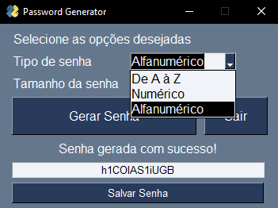

# Gerador de Senhas em Python

Este é um simples gerador de senhas feito usando a biblioteca PySimpleGUI que permite aos usuários criar senhas aleatórias com base em suas preferências.

## Características Principais
**Flexibilidade na escolha do tipo de senha:** Os usuários podem escolher entre senhas compostas apenas por letras maiúsculas e minúsculas, senhas numéricas ou senhas alfanuméricas.

**Tamanho personalizável:** O aplicativo permite que os usuários determinem o tamanho desejado para suas senhas, variando de 8 a 30 caracteres.

**Salvando Senhas:** Após gerar uma senha, os usuários têm a opção de salvá-la associada a um nome de site ou usuário em um arquivo de texto.

## Como Usar
1. Execute o programa Python.

2. Selecione o tipo de senha que deseja gerar: letras, números ou alfanumérica.

3. Escolha o tamanho da senha desejado.

4. Clique em "Gerar Senha" para criar a senha.

5. A senha gerada será exibida na interface.

6. Se desejar, você pode salvar a senha digitando um nome de site ou usuário no campo apropriado e clicando em "Salvar Senha".

## Requisitos
Este aplicativo utiliza a biblioteca PySimpleGUI para a criação da interface gráfica e foi desenvolvido em Python.

# Notas Importantes
Este projeto é uma ferramenta simples para a geração de senhas. Lembre-se sempre de armazenar suas senhas de forma segura e de não compartilhá-las com terceiros.